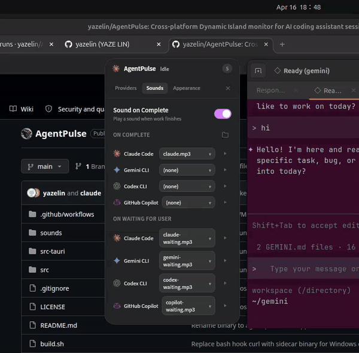
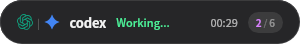
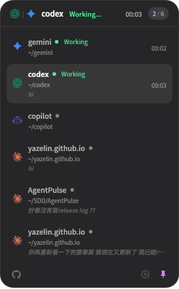
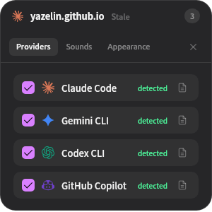
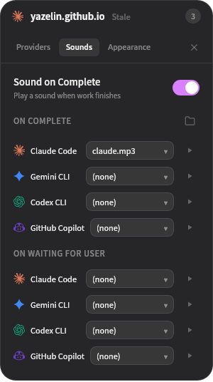
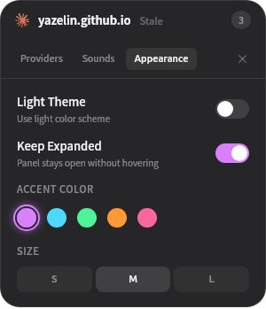

# AgentPulse

A cross-platform desktop app that brings **Dynamic Island-inspired** real-time monitoring to your AI coding assistant sessions.

> Inspired by [ClaudePulse](https://github.com/tzangms/ClaudePulse) by [@tzangms](https://github.com/tzangms) — a beautiful macOS-native app built with Swift/SwiftUI.
> AgentPulse is a cross-platform rewrite using [Tauri v2](https://tauri.app/) to support **Linux**, **Windows**, and **macOS**, extended with multi-provider support.

## Demo



> Full-quality recording with audio: [`assets/demo.mp4`](assets/demo.mp4)

<table>
  <tr>
    <td align="center"><br/><sub>Collapsed capsule</sub></td>
    <td align="center"><br/><sub>Expanded session list</sub></td>
  </tr>
</table>

## Supported AI Coding Assistants

| Provider | Hook Events | Config Location |
|----------|-------------|-----------------|
| **Claude Code** | 8 events | `~/.claude/settings.json` |
| **Gemini CLI** | 9 events | `~/.gemini/settings.json` |
| **Codex CLI** (OpenAI) | 5 events | `~/.codex/hooks.json` + `config.toml` |
| **GitHub Copilot CLI** | 6 events | `~/.copilot/config.json` |

Provider icons from [@lobehub/icons](https://github.com/lobehub/lobe-icons).

### Hook Events per Provider

| Event (normalized) | Claude | Gemini | Codex | Copilot |
|---------------------|--------|--------|-------|---------|
| SessionStart | `SessionStart` | `BeforeAgent` | `SessionStart` | `sessionStart` |
| SessionEnd | `SessionEnd` | — | — | `sessionEnd` |
| UserPromptSubmit | `UserPromptSubmit` | `BeforeModel` | `UserPromptSubmit` | `userPromptSubmitted` |
| PreToolUse | `PreToolUse` | `BeforeTool` | `PreToolUse` | `preToolUse` |
| PostToolUse | `PostToolUse` | `AfterTool` | `PostToolUse` | `postToolUse` |
| Stop | `Stop` | `AfterAgent` / `AfterModel` | `Stop` | `agentStop` / `subagentStop` |
| PermissionRequest | `PermissionRequest` | — | — | — |
| PostToolUseFailure | `PostToolUseFailure` | — | — | — |
| Notification | — | `Notification` | — | `errorOccurred` |

All events normalized to PascalCase internally. Each provider's hook command invokes the bundled sidecar binary `agent-pulse-hook`, which reads the event JSON from stdin and POSTs it to `http://localhost:{port}/hook/{provider}`. Going through a native binary instead of an inline shell one-liner keeps hooks shell-agnostic across bash / PowerShell / cmd.exe.

### Field Name Normalization

Different CLIs use different JSON field names. AgentPulse auto-detects and normalizes:

| Internal Field | Accepted Aliases |
|---------------|-----------------|
| `session_id` | `session_id`, `sessionId`, `session` |
| `hook_event_name` | `hook_event_name`, `hookEventName`, `event`, `type` |
| `cwd` | `cwd`, `workingDirectory`, `projectDir` |
| `prompt` | `prompt`, `initialPrompt`, `input`, `message`, `userPrompt` |
| `tool_name` | `tool_name`, `toolName` |

If `session_id` is missing, default ID generated as `{provider}-default`.

### Session State Machine

```
SessionStart ──▶ Idle
                  │
    UserPromptSubmit / PreToolUse / PostToolUse
                  │
                  ▼
               Working ──Stop──▶ Idle (+ completion sound)
                  │
          PermissionRequest
                  │
                  ▼
           WaitingForUser ──PreToolUse──▶ Working
              (+ waiting sound on entry)
```

**Timeout-based transitions** (checked every 10 seconds):

| Condition | Action |
|-----------|--------|
| Active session, 30 sec no events | → Idle |
| Any session, 10 min no events | → Stale (dim gray) |
| Any session, 30 min no events | Removed from list |
| `SessionEnd` event received | Removed immediately |
| User clicks X button on session | Removed immediately |

**Hook → State mapping:**

| Hook Event | State Change |
|------------|-------------|
| `SessionStart` | → Idle (new session created) |
| `UserPromptSubmit` | → Working |
| `PreToolUse` / `PostToolUse` / `PostToolUseFailure` | → Working |
| `PermissionRequest` | → WaitingForUser (triggers waiting sound on first entry) |
| `Stop` | → Idle (triggers completion sound if was Working) |
| `SessionEnd` | Session removed from list |

**Status indicator colors** (theme-adaptive via CSS variables):

| State | Dark theme | Light theme |
|-------|-----------|-------------|
| Working | `rgb(77,242,153)` (light green) | `rgb(20,140,80)` (dark green) |
| Waiting | `rgb(255,179,64)` (light orange) | `rgb(217,119,6)` (dark orange) |
| Idle | gray (text-dim) | gray (text-dim) |
| Stale | dim gray | dim gray |

## Sound System

External MP3/WAV/OGG files in `~/.config/agentpulse/sounds/`. Each provider can have two independent sounds: one for **completion** (Working → Idle) and one for **waiting for user** (any state → WaitingForUser).

### Setup

1. Open Settings → **Sounds** tab → enable **Notification Sounds**
2. Two sections appear:
   - **On Complete** — dropdown per provider
   - **On Waiting For User** — dropdown per provider
3. Click 📁 to open the sounds folder
4. Drop your MP3/WAV/OGG files there
5. Files appear in the dropdowns (each rescans on click)
6. Click ▶ next to each provider to preview

### Auto-matching

On first launch, AgentPulse auto-assigns files by filename prefix:
- `{provider}.mp3` → completion sound (e.g. `claude.mp3`)
- `{provider}-waiting.mp3` → waiting sound (e.g. `claude-waiting.mp3`)

### Bundled defaults

The repo's `sounds/` directory ships 8 default TTS sounds (Taiwanese voice `zh-TW-HsiaoChenNeural` / 曉臻):
- 4 completion clips: `{provider}.mp3` — e.g. "Claude 任務完成"
- 4 waiting clips: `{provider}-waiting.mp3` — e.g. "Claude 等待回應"

On every launch, any missing default is copied into `~/.config/agentpulse/sounds/` — so upgrading also picks up new clips automatically without clobbering user customisations.

### Generate your own TTS sounds (optional)

Generate Chinese voice notifications using [edge-tts](https://github.com/rany2/edge-tts):

```bash
pip install edge-tts
mkdir -p ~/.config/agentpulse/sounds

for p in claude gemini copilot codex; do
  # completion
  edge-tts --voice "zh-TW-HsiaoChenNeural" \
           --text "${p} 任務完成" \
           --write-media ~/.config/agentpulse/sounds/${p}.mp3
  # waiting
  edge-tts --voice "zh-TW-HsiaoChenNeural" \
           --text "${p} 等待回應" \
           --write-media ~/.config/agentpulse/sounds/${p}-waiting.mp3
done
```

Audio playback uses [`rodio`](https://github.com/RustAudio/rodio) (Rust-side, no browser CSP issues).

## Features

- **Dynamic Island Style** — Floating capsule expands on hover
- **Multi-Provider** — Claude, Gemini, Codex, Copilot simultaneously
- **Provider Icons** — Each session shows provider's official icon (lobehub/icons)
- **Status Dot** — Inline colored indicator next to project name
- **3-Line Session Info** — Project name + status, working directory, last prompt (italic)
- **Remove Session** — X button appears on row hover, click to remove
- **Smart Re-render** — Timer updates in-place, only structural changes trigger full re-render
- **Per-Provider Sounds** — Each CLI has independent sounds for completion and waiting-for-user states (Rust rodio)
- **Single Instance** — Second launch focuses the running window; no duplicate tray icons
- **Bounce Animation** — Window bounces when collapsing
- **Draggable** — Drag capsule anywhere
- **Light / Dark Theme** — Toggle in Settings or Tray
- **System Tray** — Show/Hide, Open Settings, Toggle Theme, Open Config, Restart, Quit
- **Settings (Tabbed)** — Providers / Sounds / Appearance tabs
- **Open Provider Config** — Button per provider opens its CLI config file
- **Open AgentPulse Config** — Tray menu opens `~/.config/agentpulse/config.json`
- **GitHub Link** — Action bar button opens repo in browser
- **Auto-Detection** — First launch detects installed CLIs via `which`
- **Cross-Platform** — Linux, Windows, macOS (Tauri v2)

## Install

v0.2 releases ship as plain zip archives — no installer, no package manager. Download, unzip, run. The zip contains the main binary plus the `agent-pulse-hook` sidecar; **keep the two files in the same folder** (the main app locates the sidecar at its own sibling path).

### Linux

```bash
unzip agent-pulse-vX.Y.Z-linux.zip -d agent-pulse
cd agent-pulse
chmod +x agent-pulse agent-pulse-hook
./agent-pulse
```

### macOS

Pick the right build for your chip:

- **Apple Silicon (M1 / M2 / M3 / M4)** → `agent-pulse-vX.Y.Z-macos-arm64.zip`
- **Intel Mac** → `agent-pulse-vX.Y.Z-macos-x64.zip`

```bash
unzip agent-pulse-vX.Y.Z-macos-arm64.zip -d agent-pulse
cd agent-pulse
chmod +x agent-pulse agent-pulse-hook
# Strip the quarantine xattr Gatekeeper added on download so the app can launch
xattr -cr ./agent-pulse ./agent-pulse-hook
./agent-pulse
```

**Why the `xattr` step?** AgentPulse binaries aren't signed with an Apple Developer certificate ($99/yr) yet. When you download a zip from the internet, macOS tags the files with `com.apple.quarantine` and Gatekeeper refuses to launch them — you'll see *"cannot be opened because the developer cannot be verified"*. Removing the xattr tells Gatekeeper to skip that check for this one file. Alternatively, right-click the binary in Finder → **Open** → **Open** again in the confirmation dialog.

### Windows

1. Download `agent-pulse-vX.Y.Z-windows.zip` from the Releases page
2. Right-click the zip → Extract All → pick any folder
3. Double-click `agent-pulse.exe` (Windows SmartScreen may warn on first run since the binary isn't code-signed; click **More info → Run anyway**)

Latest release: [Releases](../../releases/latest).

## Build from Source

### Prerequisites

- [Rust](https://rustup.rs/) 1.77+
- [Node.js](https://nodejs.org/) 18+
- [Tauri CLI](https://v2.tauri.app/start/prerequisites/): `cargo install tauri-cli`
- **Linux** dependencies:
  ```bash
  sudo apt install libwebkit2gtk-4.1-dev libgtk-3-dev libayatana-appindicator3-dev librsvg2-dev libasound2-dev
  ```
  (`libasound2-dev` needed by rodio for audio)

### Build

```bash
git clone https://github.com/yazelin/AgentPulse.git
cd AgentPulse
cargo tauri build
```

Output:
```
src-tauri/target/release/agent-pulse               # binary
src-tauri/target/release/bundle/deb/               # .deb
src-tauri/target/release/bundle/rpm/               # .rpm
src-tauri/target/release/bundle/appimage/          # .AppImage
```

### Development Workflow

> **Important**: Frontend files (`src/*`) are **embedded into the binary** at build time. Changes to HTML/CSS/JS require either rebuild OR using `watch.sh` (which uses `devUrl` mode).

Three scripts for different workflows:

```bash
./watch.sh         # DEV MODE — frontend hot-reloadable, Ctrl+R in window to refresh
./dev.sh           # Build debug binary + run (any change requires this)
./dev.sh release   # Build release binary + run
./reload.sh        # Just restart existing binary (no rebuild) — for testing startup flow
```

| Script | Frontend changes | Rust changes |
|--------|-----------------|-------------|
| `./watch.sh` | Ctrl+R refresh | Auto-rebuild |
| `./dev.sh` | Need rebuild | Need rebuild |
| `./reload.sh` | No effect (cached in old binary) | No effect |

`watch.sh` runs `cargo tauri dev` which serves frontend from `http://localhost:1420` via `npx serve`.

## Usage

### First Launch

1. AgentPulse opens with Settings → **Providers** tab. All providers start disabled; detection via `which` only shows a "detected" hint next to each so you know which CLIs are installed.
2. Toggle each provider you want on — each toggle immediately writes/removes its hook config (`~/.claude/settings.json`, `~/.gemini/settings.json`, etc.). No need to toggle-off-and-on.
3. (Optional) Switch to **Sounds** tab, enable **Notification Sounds**, customise per-provider completion and waiting clips.
4. Close settings — the capsule is ready.

### Controls

| Action | Effect |
|--------|--------|
| **Hover** capsule | Expand session list |
| **Move mouse away** | Collapse (with bounce animation) |
| **Drag** capsule | Reposition anywhere on screen |
| **Click** session row | Set as active session (highlight) |
| **Hover** session row | Show remove (X) button |
| **Click** X button | Remove session from list |
| **Pin** button | Keep panel expanded without hovering |
| **Gear** button | Open settings |
| **GitHub** button | Open repo in browser |

### System Tray

| Item | Effect |
|------|--------|
| **Show/Hide** | Toggle visibility (positions at current monitor top-center) |
| **Open Settings** | Show window + open settings panel |
| **Toggle Light/Dark** | Cycle theme |
| **Open Config File** | Open `~/.config/agentpulse/config.json` in default editor |
| **Restart** | Spawn new instance and exit current |
| **Quit** | Exit AgentPulse |

### Settings (Tabbed)

**Providers tab** — toggle each CLI on/off (auto installs/removes hooks), 📝 button opens that CLI's config file, auto-detection shows "detected" if the CLI binary or config dir is found, disabled providers show "coming soon" if hook setup isn't implemented yet.

<p align="center"></p>

**Sounds tab** — master "Notification Sounds" toggle controls both clips. Below it, two sections (**On Complete** and **On Waiting For User**) each give one dropdown per provider. Each dropdown rescans the sounds folder on click. ▶ previews, 📁 opens the folder.

<p align="center"></p>

**Appearance tab** — Light theme toggle, Keep Expanded toggle (pin the panel), accent color picker (Purple / Cyan / Green / Orange / Pink), size selector (S / M / L).

<p align="center"></p>

## Architecture

### How It Works

```
Claude Code ─┐
Gemini CLI   │ hook cmd: `agent-pulse-hook <provider>`
Codex CLI    │ ──► sidecar binary reads stdin + POSTs ──► AgentPulse HTTP Server
Copilot CLI  ┘                                            (localhost:19280-19289)
                                                                    │
                                                                    ▼
                                                            Session Manager
                                                            (state machine, timers)
                                                                    │
                                                                    ▼
                                                            Capsule UI (1s polling)
```

1. AgentPulse starts a TCP server on port 19280-19289 (tries each in range)
2. Port written to `~/.agentpulse/port`
3. On provider enable, hooks written to each CLI's config file (auto-cleans existing AgentPulse hooks before re-installing)
4. Each CLI invokes `agent-pulse-hook <provider_id>`, piping the event JSON on stdin
5. The sidecar reads the port file, POSTs the JSON body to `/hook/{provider_id}`, swallows any network error (so a hook misfire never breaks the host CLI)
6. Server parses URL `/hook/{id}` → identifies provider
7. Field name normalization handles different CLI JSON conventions
8. Event names normalized to common PascalCase set
9. Session manager updates state machine
10. UI polls state every 1 second; smart re-render only on structural changes
11. On Working → Idle: emits `task-completed` with provider ID → JS plays completion sound
12. On any → WaitingForUser: emits `task-waiting` with provider ID → JS plays waiting sound

### Hook Installation Details

Each CLI gets the same logical command: run the sidecar binary, pass the provider id. `hook_cmd(provider_id)` in `hooks_configurator.rs` builds the string using the absolute path of `agent-pulse-hook` (resolved via `current_exe().parent()` so it always sits next to the main binary):

```
"/absolute/path/to/agent-pulse-hook" <provider_id>
```

The sidecar reads the stdin body, resolves the live port from `~/.agentpulse/port`, and POSTs to `/hook/<provider_id>`. No bash, no PowerShell, no `$(cat)` — works identically on every OS.

**Why a sidecar?** Before v0.2, hook commands were a bash one-liner using `$(cat)` and `curl`. Each CLI on Windows executes hook commands through a different shell (Claude's optional `shell: powershell` field, Gemini's hard-coded PowerShell, Copilot's separate `powershell` field, Codex — Windows disabled entirely). Maintaining four dialects of the same command is fragile. A native binary invocation sidesteps every shell-quoting edge case.

**Claude Code** (`~/.claude/settings.json`):
```json
{
  "hooks": {
    "SessionStart": [{
      "matcher": "",
      "hooks": [{ "type": "command", "command": "\"/usr/bin/agent-pulse-hook\" claude", "async": true }]
    }]
  }
}
```

**Gemini CLI** (`~/.gemini/settings.json`):
```json
{
  "hooks": {
    "BeforeAgent": [{
      "matcher": "",
      "hooks": [{ "type": "command", "command": "\"/usr/bin/agent-pulse-hook\" gemini", "async": true }]
    }]
  }
}
```

**Codex CLI** (`~/.codex/hooks.json` + `~/.codex/config.toml`):
```json
{
  "hooks": {
    "SessionStart": [{
      "hooks": [{ "type": "command", "command": "\"/usr/bin/agent-pulse-hook\" codex" }]
    }]
  }
}
```
And in `config.toml`:
```toml
[features]
codex_hooks = true
```
(Codex hooks are behind a feature flag in the current beta. OpenAI currently disables hook execution on Windows; the sidecar command is still written but won't fire until they re-enable it.)

**GitHub Copilot CLI** (`~/.copilot/config.json` — uses `bash` field):
```json
{
  "hooks": {
    "sessionStart": [{ "type": "command", "bash": "\"/usr/bin/agent-pulse-hook\" copilot" }]
  }
}
```

### Config File

`~/.config/agentpulse/config.json`:
```json
{
  "setup_done": true,
  "appearance": {
    "accent_color": "purple",
    "text_size": "medium",
    "theme": "dark",
    "pin_expanded": false,
    "sound_enabled": true,
    "provider_sounds": {
      "claude": "claude.mp3",
      "gemini": "gemini.mp3",
      "codex": "__none__",
      "copilot": "copilot.mp3"
    },
    "provider_waiting_sounds": {
      "claude": "claude-waiting.mp3",
      "gemini": "gemini-waiting.mp3",
      "codex": "__none__",
      "copilot": "copilot-waiting.mp3"
    }
  },
  "providers": {
    "claude": { "enabled": false, "name": "Claude Code", "settings_path": "~/.claude/settings.json" },
    "gemini": { "enabled": false, "name": "Gemini CLI", "settings_path": "~/.gemini/settings.json" },
    "codex": { "enabled": false, "name": "Codex CLI", "settings_path": "~/.codex/hooks.json" },
    "copilot": { "enabled": false, "name": "GitHub Copilot", "settings_path": "~/.copilot/config.json" }
  }
}
```

All providers default to `enabled: false` — the user explicitly turns each one on, which triggers the hook install. (`provider_sounds` / `provider_waiting_sounds` value `"__none__"` means the user explicitly chose no sound for that provider/state combo.)

## Tech Stack

| Component | Technology |
|-----------|-----------|
| Framework | Tauri v2 |
| Backend | Rust (tokio, serde, chrono, rodio) |
| Frontend | HTML / CSS / JS (no framework, no bundler) |
| HTTP Server | tokio TCP (raw HTTP parsing) |
| Window | WebKitGTK (Linux), WebView2 (Windows), WKWebView (macOS) |
| Audio | rodio (Rust audio playback) |
| Icons | [@lobehub/icons](https://github.com/lobehub/lobe-icons) (inline SVG) |
| Linux extras | `webkit2gtk`, `gtk`, `gdk` crates for window management |

## Project Structure

```
AgentPulse/
├── src/                           # Frontend
│   ├── index.html                 # Capsule, expanded, settings views (tabbed)
│   ├── styles.css                 # All styles, theme-adaptive via CSS vars
│   └── main.js                    # Tauri IPC, state, UI, provider icons, sound playback
├── src-tauri/                     # Backend (Rust)
│   ├── Cargo.toml                 # Dependencies (tauri, rodio, webkit2gtk, etc.)
│   ├── tauri.conf.json            # Window, tray, bundle, devUrl config
│   ├── capabilities/default.json  # Tauri v2 permissions
│   └── src/
│       ├── lib.rs                 # App setup, tray, window mgmt, all Tauri commands
│       ├── config.rs              # Config R/W, provider detection, sounds dir, default seeding
│       ├── hook_server.rs         # TCP HTTP server, URL routing, event normalization
│       ├── hook_event.rs          # RawHookEvent (field aliases) → HookEvent (normalized)
│       ├── session.rs             # State machine, SessionManager, SessionTransition, AppState
│       ├── hooks_configurator.rs  # Per-provider hook install/remove (4 different formats)
│       └── bin/
│           └── agent-pulse-hook.rs # Sidecar binary invoked by CLI hooks; POSTs to localhost
├── sounds/                        # Bundled default TTS sounds (zh-TW HsiaoChen voice)
│   ├── claude.mp3                 # completion clips
│   ├── gemini.mp3
│   ├── codex.mp3
│   ├── copilot.mp3
│   ├── claude-waiting.mp3         # waiting-for-user clips
│   ├── gemini-waiting.mp3
│   ├── codex-waiting.mp3
│   └── copilot-waiting.mp3
├── watch.sh                       # Dev mode with frontend hot-reload (devUrl)
├── dev.sh                         # Build debug/release binary + run
├── reload.sh                      # Restart existing binary (no rebuild)
├── package.json
├── README.md
└── LICENSE
```

## Known Limitations (Linux / X11)

| Issue | Workaround |
|-------|------------|
| `rgba()` backgrounds ghost on transparent windows | Opaque `rgb()` backgrounds; transparent window only for rounded corners |
| CSS `-webkit-app-region: drag` doesn't work | Tauri `startDragging()` API via JS `mousedown` |
| `mouseleave` unreliable on transparent windows | Tauri `cursor-left` event from Rust polling thread |
| `<select>` dropdown uses system native styling | Custom div-based dropdown |
| CSS `transition` / `animation` causes pixel ghosting | Most transitions removed; bounce via Rust `set_position` thread |
| `transform: translateZ(0)` creates black compositing layers | Not used |
| DOM re-render destroys hover state | Smart re-render: structural changes only; timers update in-place |
| Browser CSP blocks blob URLs and local files | Audio plays via Rust `rodio` (no browser audio at all) |
| Click-to-focus terminal window | Not implemented — gnome-terminal-server architecture makes per-window PID lookup unreliable |

## Credits

- Original [ClaudePulse](https://github.com/tzangms/ClaudePulse) by [@tzangms](https://github.com/tzangms)
- Provider icons from [@lobehub/icons](https://github.com/lobehub/lobe-icons)
- Audio playback via [rodio](https://github.com/RustAudio/rodio)
- Default TTS sounds via [edge-tts](https://github.com/rany2/edge-tts)

## License

MIT
